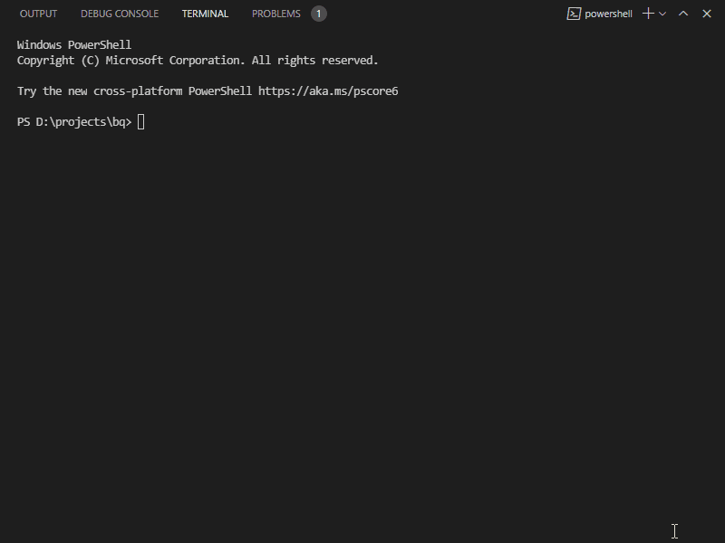

<p align="center">
  
</p>

<p align="right">
  <span>English</span> | <a href="./docs/README_RU.md">Русский</a>
</p>

# Authorization (client)

Auth client boilerplate using React with TypeScript, state container Redux.

It can be used as starter for a new project: implements API for user sign up/sign in (incl. in with social media) and features like email verification, forgotten password, reset password.

## Implementation Details

- React frontend initialized by [create-react-app](https://github.com/facebook/create-react-app) with Typescript. Functional Components and Hooks;
- Predictable state container [Redux](https://github.com/reduxjs/redux), using [redux-thunk](https://github.com/reduxjs/redux-thunk) and [redux-logger](https://github.com/LogRocket/redux-logger) middlewares;
- Uses [react-router](https://github.com/ReactTraining/react-router) for routing;
- Internationalization [i18next](https://github.com/i18next/react-i18next);
- [Sass](https://github.com/sass/sass) preprocessor for СSS.

## Screencast



## How to use

- Clone this repo
- Run `npm install` to install the packages declared in `package.json`
- For setting work authorization social medias in file `./src/shared/constants.ts` you need to specify constants: `FACEBOOK_CLIENT_ID, GOOGLE_CLIENT_ID, VK_CLIENT_ID`
- Run the app

```bash
$ npm start
```

Runs the app in the development mode. Open [http://localhost:3000](http://localhost:3000) to view it in the browser.\
The page will reload if you make edits.\
You will also see any lint errors in the console.

## Build

```bash
$ npm run build
```

Builds the app for production to the `build` folder.\
It correctly bundles React in production mode and optimizes the build for the best performance.

The build is minified and the filenames include the hashes.\
Your app is ready to be deployed!

## Server

A server in repo [auth-server](https://github.com/sulakin/auth-server) has been implemented for this application.

<p align="center">
  <a href="https://github.com/sulakin/auth-server" title="Authorization (server)">
    
  </a>
</p>

## License

Copyright © 2021 MIT by [Sulakin Vadim](https://github.com/sulakin)
